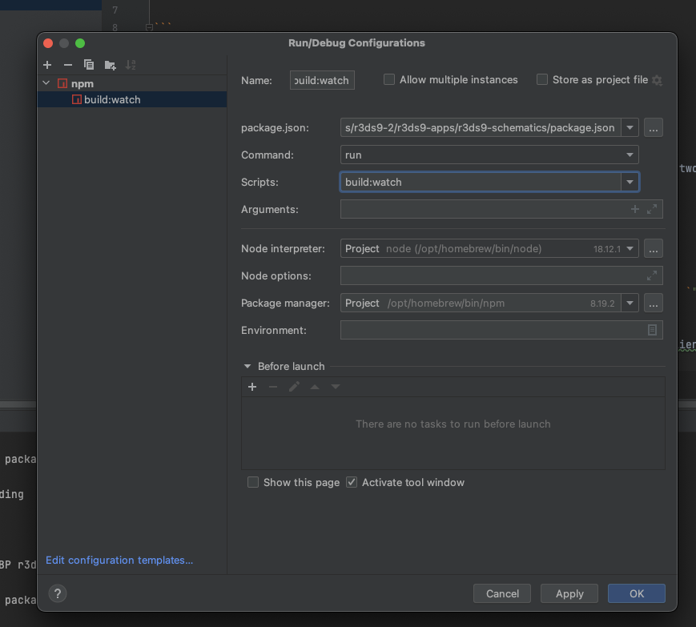

# R3DS9-Schematics

## Setup

The schematics cli has to be installed with the command `npm install -g @angular-devkit/schematics-cli` if not already present.
Next the project has been created with the cli by issuing.

```
schematics blank --name=r3ds9-schematics
```

This creates a subdirectory with the stuff.

- Execute `npm install` to install dependencies.
- Add support and helpers with `npm i --save @schematics/angular`
- Add support for the [diff package](https://www.npmjs.com/package/diff) with the two commands:

```
npm i diff
npm i @types/diff --save-dev
```

For dev purposes, create a script in the `package.json` that could look like this: `"build:watch": "tsc -p tsconfig.json --watch",`. In this way a modification
will trigger the rebuild.

In JetBrains create a new `Run >> Edit Configurations...` selezionando npm e scegliendo per lo script il `build:watch` appena creato.



### Use the schematics in an angular project

This schematics is not published as to speak. To use it in an Angular project it can be linked from the angular project with the
`npm link` command with the relative pathname from the angular project to this project home. The command has to be issued in the
angular project root directory. In my test case I used: `npm link ../alx-schematics`.

## Adding a Schematics

In the project folder run the command `schematics blank --name=NAME-OF-SCHEMATICS` (i.e. `schematics blank --name=types`).
This will create a folder under `src` with the name `NAME-OF-SCHEMATICS`.
In the new folder create a file `schema.json` with this [initial content](src/types2/schema.json) (note: types is NAME-OF-SCHEMATICS).
This will provide information on the type of params accepted by the schematic.

In the `collection.json` add the reference to the just created schema file:

```
"schema": "./NAME-OF-SCHEMATICS/schema.json"
```

The `collection.json` now should look like:

```json
{
  "$schema": "../node_modules/@angular-devkit/schematics/collection-schema.json",
  "schematics": {
    "r3ds9-schematics": {
      "description": "r3ds9 schematic.",
      "factory": "./r3ds9-schematics/index#r3ds9Schematics"
    },
    "types": {
      "description": "a schematic to create typescript data beans",
      "factory": "./types/index#dtoModel",
      "schema": "./types/schema.json"
    }
  }
}
```

Now in the NAME-OF-SCHEMATICS folder run `npx -p dtsgenerator dtsgen schema.json -o schema.d.ts`.
The first time might ask to install a dependency. Now you have a `schema.d.ts` file with the definition of a Schema Object.
In the last run it gave me:

```
Need to install the following packages:
  dtsgenerator@3.16.1
Ok to proceed? (y) y
DeprecationWarning: 'createInterfaceDeclaration' has been deprecated since v4.8.0. Decorators are no longer supported for this function. 
    Callers should switch to an overload that does not accept a 'decorators' parameter.
```

Open the `index.ts` file and change the rule entrypoint from

```
export function types(_options: any): Rule {
```

to (note: `TypesSchema` is the interface created using `types` as the NAME-OF-SCHEMATICS)

```
export function types(_options: DTOModelSchema): Rule {
```

Every time the `schema.json` is changed, re-run the generator to keep the typescript aligned.

### Testing

To run a test against a schematics use a command like this from terminal or add to the scripts in package.json
In the example dro-model is the current schematic 

```
npm run build && jasmine src/types/*_spec.js
```

### Schema.json

A few notes on the schema.json file

- The options on the command line have to be provided dasherized: that is if you have an option named onConflict, then, on command line should be provided as --on-conflict [camel case arguments are no longer allowed](https://github.com/angular/angular-cli/issues/23548)
- On the other side, options in the schema.json are better off to be defined in camelCase for typescript reasons. Apparently names with `_` gives problems in the matching with command line processing (didn't completely sort out the issue)
- There are a number of predefined __$source__ to use to initialize the params; below few relevant cases: `workingDirectory` path is set to the working directory (relative to the project path, i.e. `src/app/...` ), `argv` for some positional information in the command line, `projectName`
to initialize the value to the name of the project.... 

```json
    "path": {
      "type": "string",
      "format": "path",
      "description": "The path to create the objects.",
      "visible": false,
      "$default": {
        "$source": "workingDirectory"
      }
    },    
    "name": {
      "type": "string",
      "$default": {
        "$source": "argv",
        "index": 0
      }
    },
    "project": {
      "type": "string",
      "description": "The name of the project.",
      "$default": {
        "$source": "projectName"
      }
    }
```

### Artifacts location resolution

Since schematics is a matter of code generation, there is the need to determine from the input params where to create the expected artifacts.
The Logic is in the `shared/util/location.ts` file and is invoked in the `index.ts`:

```ts
const workspacePathInfo =  await getWorkspacePathInfo(_context, tree,  _options.project);
const fileLocation = getLocation(_context, workspacePathInfo, _options.path as Path, _options.name);
_options.name = dasherize(fileLocation.name);
_options.argv_path = fileLocation.path;
_options.path = fileLocation.path || '';
if (!_options.flat) {
  _options.path = join(_options.path as Path, _options.name);
}
```

The `workspacePathInfo` in general is something like `src/app` (might be different in multi project workspace). At the end options.path is set to the actual location where to put the stuff... 

### Guides

A list of useful resources on the topic.

- [Schematics — An Introduction](https://blog.angular.io/schematics-an-introduction-dc1dfbc2a2b2)
- [Total Guide To Custom Angular Schematics](https://tomastrajan.medium.com/total-guide-to-custom-angular-schematics-5c50cf90cdb4)
- [Speed up your Angular schematics development with useful helper functions](https://indepth.dev/posts/1356/speed-up-your-angular-schematics-development-with-useful-helper-functions)
- [Angular Schematics from 0 to publishing your own library (I)](https://indepth.dev/posts/1323/angular-schematics-from-0-to-publishing-your-own-library-i)
- [Angular Schematics from 0 to publishing your own library (II)](https://indepth.dev/posts/1329/angular-schematics-from-0-to-publishing-your-own-library-ii)
- [Angular Schematics from 0 to publishing your own library (III)](https://indepth.dev/posts/1342/angular-schematics-from-0-to-publishing-your-own-library-iii)
- [Angular Schematics from 0 to publishing your own library (IV)](https://indepth.dev/posts/1343/angular-schematics-from-0-to-publishing-your-own-library-iv)
- [GitHub Schematics](https://github.com/angular/angular-cli/tree/master/packages/angular_devkit/schematics)
- [angular.io](https://angular.io/guide/schematics)
- [The Complete Guide to Custom Angular Schematics](https://morioh.com/p/e2e00c50cd7e)


### Testing

To test locally, install `@angular-devkit/schematics-cli` globally and use the `schematics` command line tool. That tool acts the same as the `generate` command of the Angular CLI, but also has a debug mode.

Check the documentation with

```bash
schematics --help
```

### Unit Testing

`npm run test` will run the unit tests, using Jasmine as a runner and test framework.

### Publishing

To publish, simply do:

```bash
npm run build
npm publish
```

That's it!
